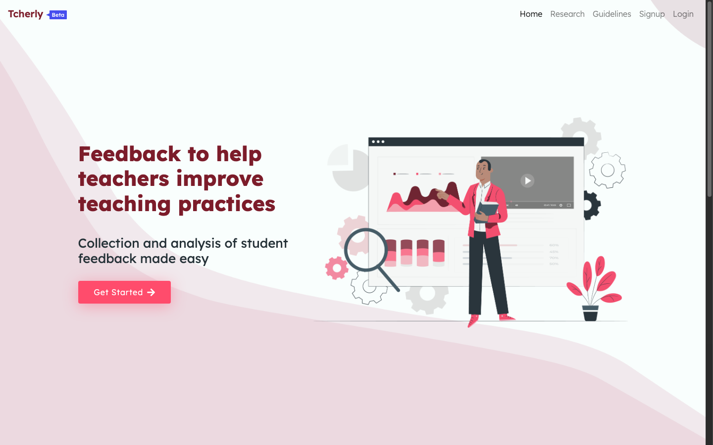
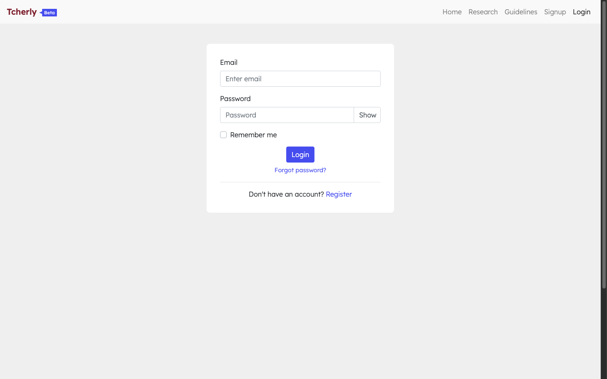
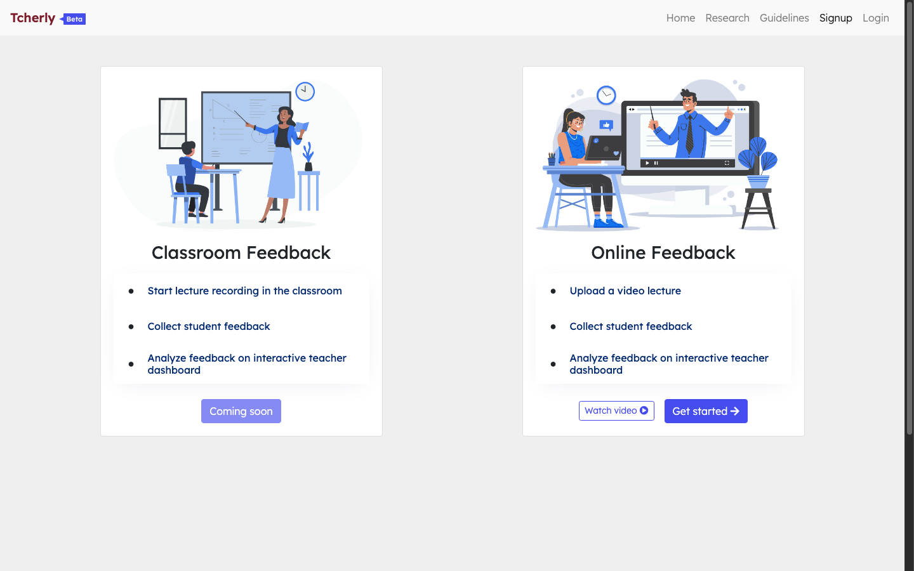
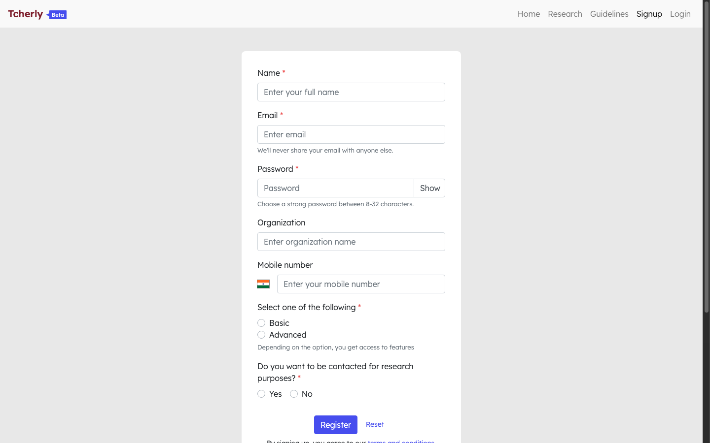
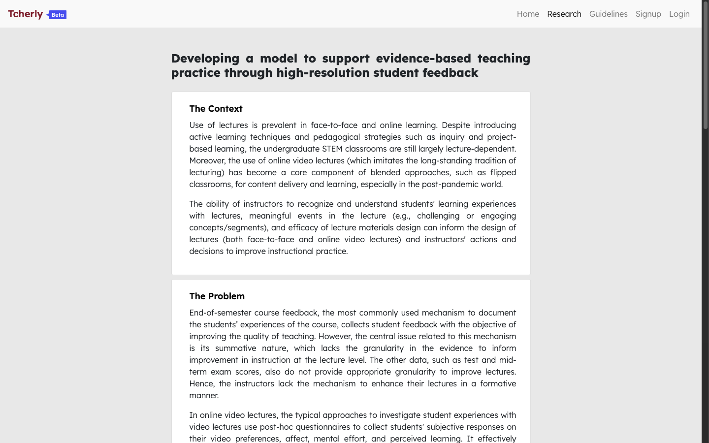

# Tcherly

> *Online student-feedback tool for improving lecture teaching practice.*

Tcherly (formerly **DEBE** — *Difficult, Easy, Boring, Engaging*) helps educators collect **high-resolution, in-lecture student feedback** and turn it into actionable pedagogical interventions. Developed from educational technology research at **IDP-ET, IIT Bombay**, Tcherly addresses the latency and coarseness of traditional end-of-semester surveys by providing real-time, minute-by-minute formative feedback during video lectures.

Live deployment: [https://www.tcherly.com](https://www.tcherly.com)

---

## Table of Contents

- [Overview & Core Loop](#overview--core-loop)
- [Tech Stack](#tech-stack)
- [Architecture & Diagrams](#architecture--diagrams)
- [Screenshots](#screenshots)
- [Installation & Setup](#installation--setup)
- [Available Commands](#available-commands)
- [Documentation](#documentation)

---

## Overview & Core Loop

```
Teacher creates Lesson (YouTube video)
        │
        ▼  Shares /l/<slug> link with students
Students watch video and submit real-time reactions at any timestamp:
        Difficult · Easy · Boring · Engaging  (+ optional sub-reasons)
        │
        ▼  Clicks stored with video timestamps
Teacher reviews Lesson Dashboard:
        Line charts · Venn diagrams · Radial charts · Participation · Detailed sub-reasons
        │
        ▼  Scrubs timeline to locate moments of difficulty or drop in engagement
Bookmark ──► Question ("Why did engagement drop at min 12?") ──► Action ("Add worked example")
        │
        ▼
Pedagogical intervention applied to future lectures
```

---

## Tech Stack

| Area | Technologies |
|---|---|
| **Backend** | Node.js, Express, Passport (Local & JWT), express-session, Handlebars (`hbs`) |
| **Frontend** | React 17 (Create React App in `client/`), React Router 5, Bootstrap 4 / react-bootstrap, Formik + Yup |
| **Database** | MongoDB via Mongoose 5, session store with connect-mongo |
| **Data Visualization** | Recharts, D3, `@upsetjs/venn.js`, Custom SVG radial heatmaps |
| **Integrations** | `react-player` (YouTube embed), `simple-youtube-api`, Mailgun, ExcelJS |
| **Tooling & Deploy** | Yarn, nodemon, concurrently, PM2 (`ecosystem.config.js`) |

---

## Architecture & Diagrams

Comprehensive architectural specifications and system diagrams are documented in dedicated guides:

- **[System Architecture](documents/ARCHITECTURE.md)** — High-level system context diagram, authenticated request flows, and feedback analysis pipeline overview.
- **[Data Flow Diagrams](documents/DATA_FLOW.md)** — Detailed sequence and flow diagrams covering student feedback capture (write path), teacher dashboard rendering (read path), pipeline internals, three-identity auth model, and Excel export.
- **[Entity Relationship Diagram](documents/ER_DIAGRAM.md)** — Complete Mongoose schema relationships across all 13 models (`User`, `Student`, `Researcher`, `Course`, `Lesson`, `Feedback`, `Bookmark`, `Log`, etc.).

---

## Screenshots

> Captured from the live platform at [tcherly.com](https://www.tcherly.com).

### 1. Landing Page

*Home: Product introduction and "Get Started" entry into signup.*

### 2. Teacher Login

*Teacher authentication with email/password and password recovery.*

### 3. Registration Mode Selection

*Registration selection: Classroom Feedback (upcoming) or Online Feedback.*

### 4. Online Feedback Registration

*Signup form capturing institution, mode, feature tier, and research consent.*

### 5. Research Background

*Background: Pedagogical context and problem statement for in-lecture formative feedback.*

---

## Installation & Setup

### Prerequisites

Ensure you have the following installed:

1. **[Node.js](https://nodejs.org/)**:
   - Recommended: Node.js `v14.x` or `v16.x` LTS.
   - *Node 17+ note*: React Scripts 4.0.1 (Webpack 4) requires the legacy OpenSSL provider. If using Node 17+, run `export NODE_OPTIONS=--openssl-legacy-provider`.
2. **[Yarn](https://classic.yarnpkg.com/en/docs/install/)** (v1.x):
   ```bash
   npm install --global yarn
   ```
3. **[MongoDB](https://www.mongodb.com/)** (v4.4+) running locally (`mongodb://localhost:27017/debe` in `.env.example`, falling back to `mongodb://localhost:27017/test-debe`) or via a remote connection string.

### Step-by-step Setup

1. **Clone the repository:**
   ```bash
   # Via SSH:
   git clone git@github.com:IITB-EdTech/tcherly.git
   cd tcherly

   # Or via HTTPS:
   git clone https://github.com/IITB-EdTech/tcherly.git
   cd tcherly
   ```

2. **Install server and client dependencies:**
   ```bash
   yarn
   yarn install:c
   ```

3. **Configure environment variables:**
   - Copy root backend `.env`:
     ```bash
     cp .env.example .env
     ```
   - Copy client `.env`:
     ```bash
     cp client/.env.example client/.env
     ```
   - Review and update MongoDB URI, token secrets, and optional YouTube/Mailgun keys (see [ENVIRONMENT.md](documents/ENVIRONMENT.md)).

4. **Start the development servers:**
   ```bash
   yarn dev
   ```
   - Frontend UI: [http://localhost:8080](http://localhost:8080)
   - Backend API: [http://localhost:3000](http://localhost:3000)

For comprehensive setup options, production deployment, troubleshooting, and CLI researcher seeding, see [INSTALLATION.md](documents/INSTALLATION.md).

---

## Available Commands

| Command | Description | Notes |
|---|---|---|
| `yarn dev` | Starts both server and client development servers concurrently | Backend: `http://localhost:3000`, Client: `http://localhost:8080` |
| `yarn dev:s` | Starts backend development server with `nodemon` | Restarts automatically on file changes |
| `yarn dev:c` | Starts frontend React dev server | Create React App development server |
| `yarn install:c` | Installs client-specific dependencies in `client/` | Shortcut for `cd client && yarn` |
| `yarn build` | Builds the React frontend for production | Outputs static bundle to `client/build` |
| `yarn serve` | Builds the client and starts the production server | Sets `NODE_ENV=production` |
| `yarn deploy` | Deploys using PM2 | Uses `ecosystem.config.js` |
| `yarn generate` | Seeds researcher accounts via CLI | Run `yarn generate --help` for usage |

---

## Documentation

- **[INSTALLATION.md](documents/INSTALLATION.md)** — Detailed setup prerequisites and instructions.
- **[DEPLOYMENT.md](documents/DEPLOYMENT.md)** — Production deployment guide with PM2, Nginx, and SSL setup.
- **[ENVIRONMENT.md](documents/ENVIRONMENT.md)** — Comprehensive environment variable configuration reference.
- **[OVERVIEW.md](documents/OVERVIEW.md)** — Deep-dive system architecture, actors, feature map, and pipeline mechanics.
- **[ARCHITECTURE.md](documents/ARCHITECTURE.md)** — Mermaid diagrams of system context and analysis pipeline.
- **[DATA_FLOW.md](documents/DATA_FLOW.md)** — In-depth sequence and flow diagrams for data transactions.
- **[ER_DIAGRAM.md](documents/ER_DIAGRAM.md)** — Database schema and entity relationships.
- **[FEEDBACK.md](documents/FEEDBACK.md)** — Notes on feedback classification and interaction models.
- **[NOTES.md](documents/NOTES.md)** — Developer notes and system logs reference.
- **[LIST.md](documents/LIST.md)** — Project checklist and feature items.