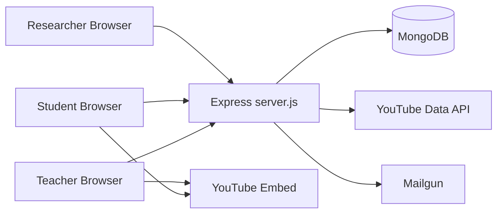
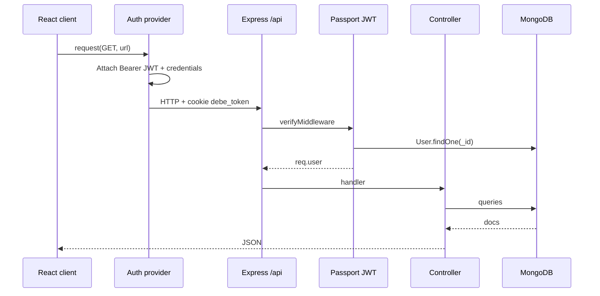
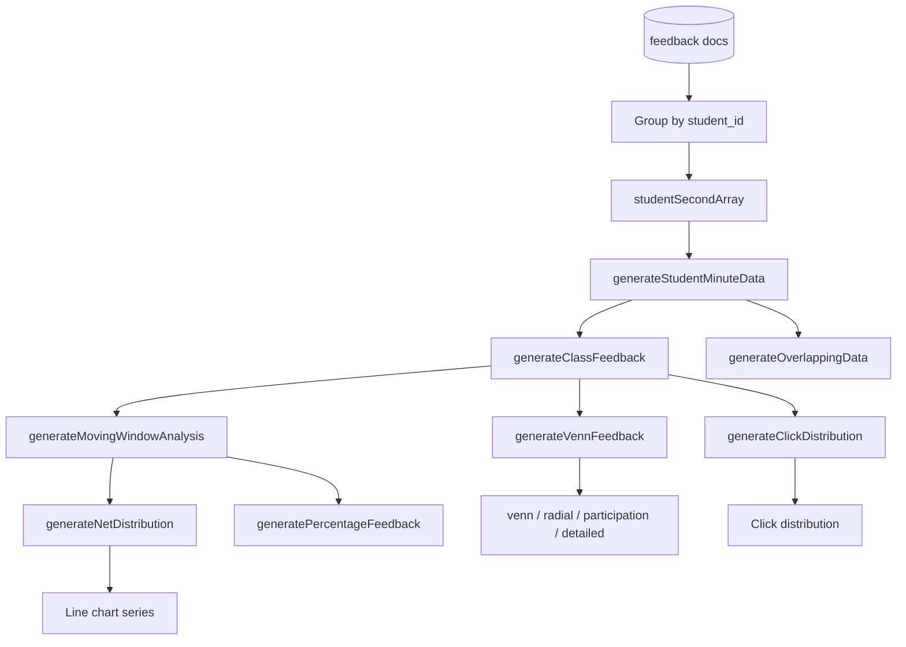

# Architecture Diagrams

## System context

```mermaid
flowchart LR
  Teacher[Teacher Browser]
  Student[Student Browser]
  Researcher[Researcher Browser]
  Express[Express server.js]
  Mongo[(MongoDB)]
  YT[YouTube Data API]
  MG[Mailgun]
  YTEmbed[YouTube Embed]

  Teacher --> Express
  Student --> Express
  Researcher --> Express
  Student --> YTEmbed
  Teacher --> YTEmbed
  Express --> Mongo
  Express --> YT
  Express --> MG
```

## Request path (authenticated teacher)

```mermaid
sequenceDiagram
  participant C as React client
  participant A as Auth provider
  participant E as Express /api
  participant P as Passport JWT
  participant Ctrl as Controller
  participant DB as MongoDB

  C->>A: request(GET, url)
  A->>A: Attach Bearer JWT + credentials
  A->>E: HTTP + cookie debe_token
  E->>P: verifyMiddleware
  P->>DB: User.findOne(_id)
  P-->>E: req.user
  E->>Ctrl: handler
  Ctrl->>DB: queries
  DB-->>Ctrl: docs
  Ctrl-->>C: JSON
```

## Feedback analysis pipeline

```mermaid
flowchart TD
  FB[(feedback docs)] --> Group[Group by student_id]
  Group --> Sec[studentSecondArray]
  Sec --> Min[generateStudentMinuteData]
  Min --> Class[generateClassFeedback]
  Class --> MW[generateMovingWindowAnalysis]
  MW --> Net[generateNetDistribution]
  MW --> Pct[generatePercentageFeedback]
  Class --> Click[generateClickDistribution]
  Min --> Over[generateOverlappingData]
  Class --> Venn[generateVennFeedback]
  Venn --> Charts[venn / radial / participation / detailed]
  Net --> LineChart[Line chart series]
  Click --> Gauge[Click distribution]
```
