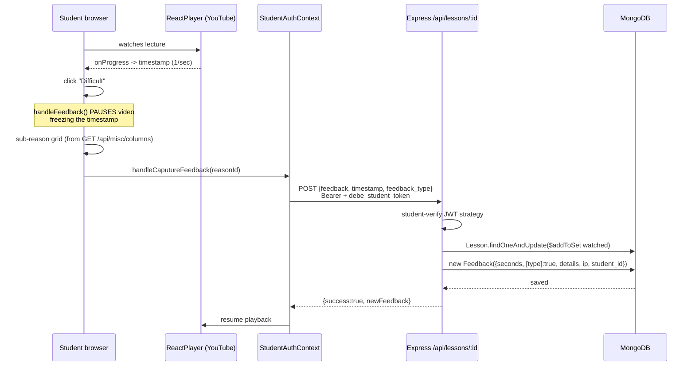
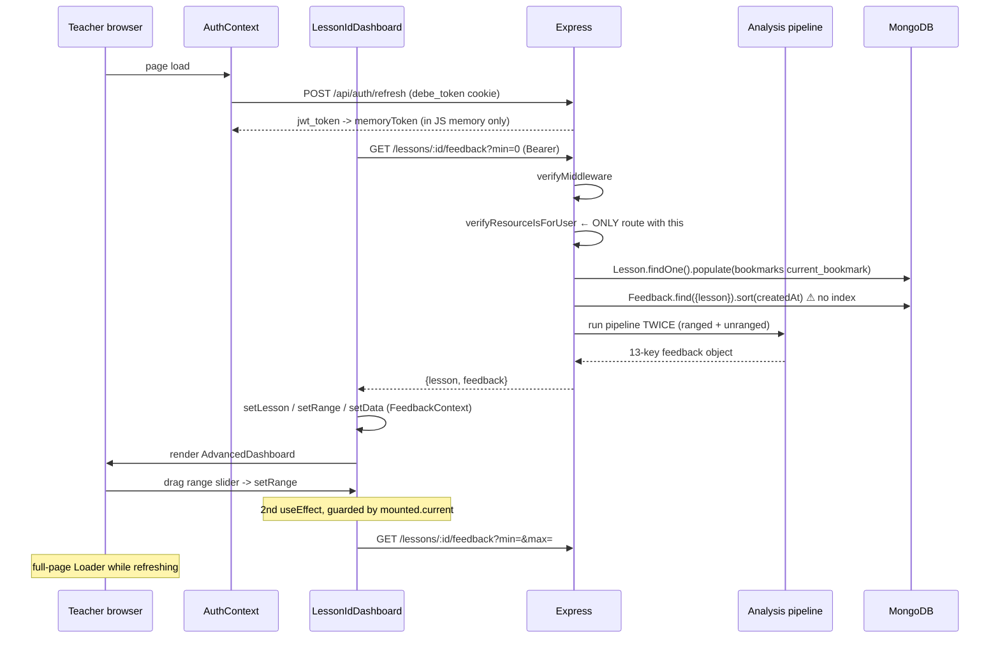
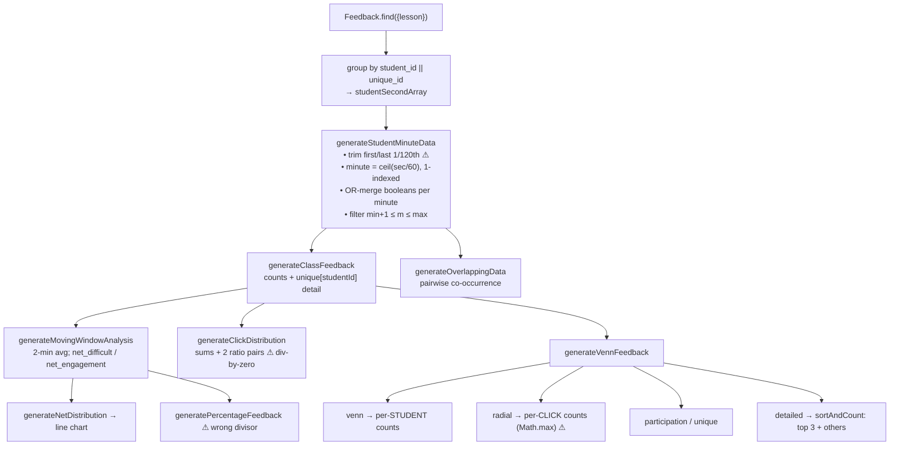
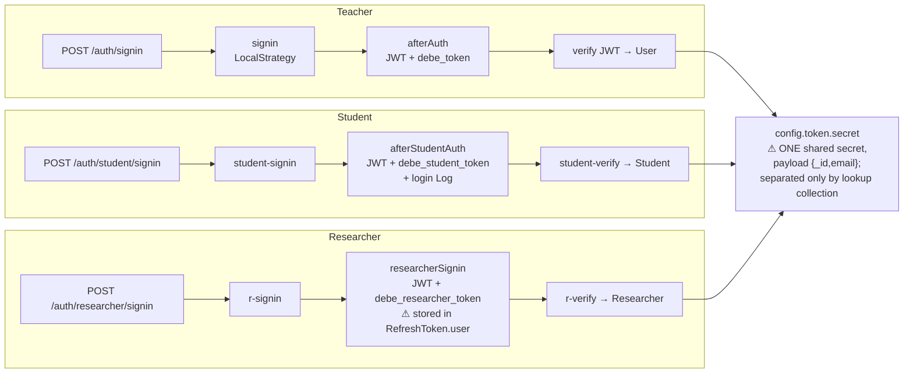
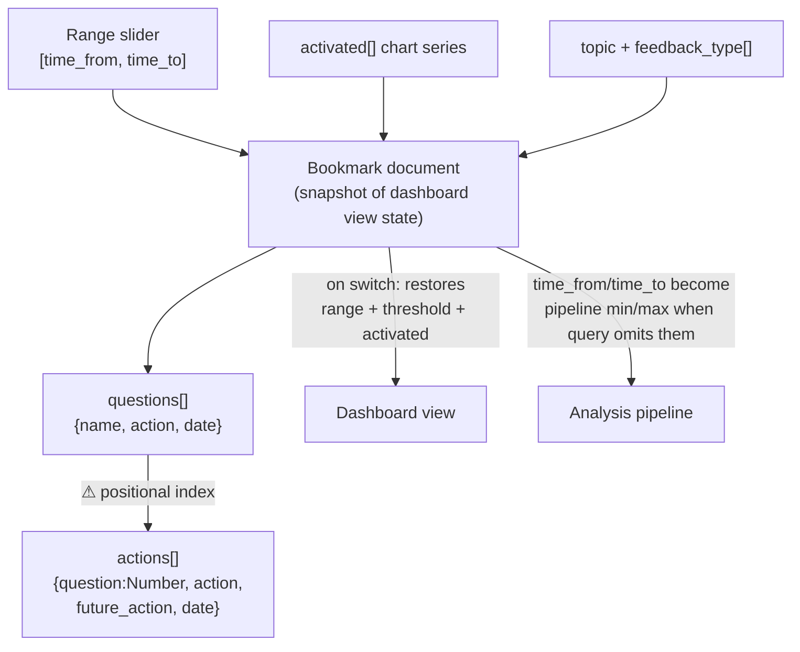
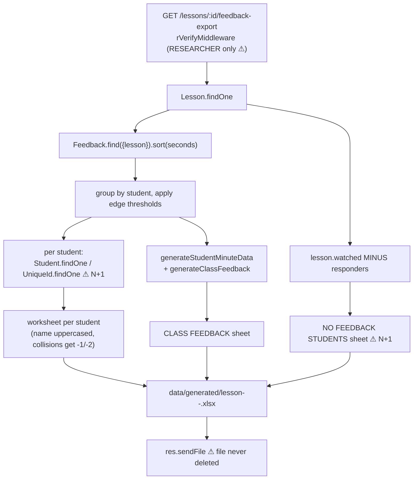

# Data Flow Diagrams

Companion to [`OVERVIEW.md`](./OVERVIEW.md).

---

## 1. Student feedback capture (write path)

`client/src/pages/lesson-id.jsx` → `POST /api/lessons/:id` → `controllers/feedback.js:recordFeedback`



**`details` dispatch** (`feedback.js:657-663`):

| `feedback_type` | Stored as |
|---|---|
| omitted | `details.none = true` |
| `"other"` | `details.other = other_message` |
| enum id | `details[feedback] = feedback_type` |

---

## 2. Teacher dashboard load (read path)



---

## 3. Analysis pipeline internals

`controllers/feedback.js` — run twice per request (ranged + unranged).



> ⚠ `venn` (students) and `radial` (clicks) are **different units** from the same function.

---

## 4. Three-identity auth model



Both auth contexts are mounted simultaneously on `/l/:id`: the teacher `AuthContext` from the app root, plus `ProvideStudentAuth` from `pages/lesson-id.jsx:72`.

---

## 5. Bookmark → Question → Action chain



**Persistence:** `questions` / `actions` are edited by **whole-array replacement** (`PUT .../edit-questions`, `.../edit-actions`) — last write wins, no concurrency control. `actions[].question` is a **positional index**, so deleting a question silently re-points every action.

---

## 6. Excel export



---

## 7. Request middleware chain (`server.js`)

```
serveFavicon
  → express.json / urlencoded
  → cookieParser                    (must precede all refresh-token reads)
  → cors                            (DEV ONLY)
  → [await db.connect()]            (fail-open: server starts even if Mongo is down)
  → session                         (only if DB connected; vestigial — no route uses it)
  → morgan dev + morgan → debe_online.log   (no rotation)
  → passport.initialize()           (provides req.isAuthenticated())
  → trust proxy = true
  → express.static(public)
  → routes: / · /api/auth · /api/courses · /api/lessons · /api/misc · /api/sync
            (/api/researcher is nested inside routes/index.js)
  → /api/* catch-all → 404
  → [production] static(client/build) + SPA fallback
  → error handler                   ⚠ sets status, NEVER sends → 500s hang
```
