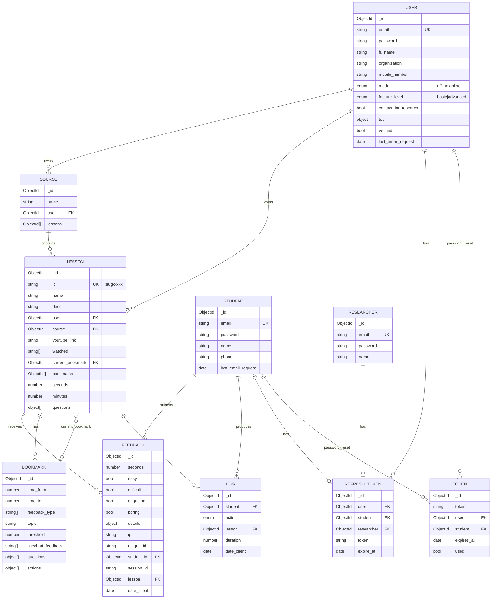

# Entity Relationship Diagram

Source models live under `database/models/`.

```mermaid
erDiagram
  USER ||--o{ COURSE : owns
  USER ||--o{ LESSON : owns
  COURSE ||--o{ LESSON : contains
  LESSON ||--o{ FEEDBACK : receives
  LESSON ||--o{ BOOKMARK : has
  LESSON }o--o| BOOKMARK : current_bookmark
  STUDENT ||--o{ FEEDBACK : submits
  STUDENT ||--o{ LOG : produces
  LESSON ||--o{ LOG : tracks
  USER ||--o| REFRESH_TOKEN : has
  STUDENT ||--o| REFRESH_TOKEN : has
  RESEARCHER ||--o| REFRESH_TOKEN : has
  USER ||--o{ TOKEN : password_reset
  STUDENT ||--o{ TOKEN : password_reset

  USER {
    ObjectId _id
    string email UK
    string password
    string fullname
    string organization
    string mobile_number
    enum mode "offline|online"
    enum feature_level "basic|advanced"
    bool contact_for_research
    object tour
    bool verified
    date last_email_request
  }

  COURSE {
    ObjectId _id
    string name
    ObjectId user FK
    ObjectId[] lessons
  }

  LESSON {
    ObjectId _id
    string id UK "slug-xxxx"
    string name
    string desc
    ObjectId user FK
    ObjectId course FK
    string youtube_link
    string[] watched
    ObjectId current_bookmark FK
    ObjectId[] bookmarks
    number seconds
    number minutes
    object[] questions
  }

  FEEDBACK {
    ObjectId _id
    number seconds
    bool easy
    bool difficult
    bool engaging
    bool boring
    object details
    string ip
    string unique_id
    ObjectId student_id FK
    string session_id
    ObjectId lesson FK
    date date_client
  }

  BOOKMARK {
    ObjectId _id
    number time_from
    number time_to
    string[] feedback_type
    string topic
    number threshold
    string[] linechart_feedback
    object[] questions
    object[] actions
  }

  STUDENT {
    ObjectId _id
    string email UK
    string password
    string name
    string phone
    date last_email_request
  }

  LOG {
    ObjectId _id
    ObjectId student FK
    enum action
    ObjectId lesson FK
    number duration
    date date_client
  }

  RESEARCHER {
    ObjectId _id
    string email UK
    string password
    string name
  }

  REFRESH_TOKEN {
    ObjectId _id
    ObjectId user FK
    ObjectId student FK
    ObjectId researcher FK
    string token
    date expire_at
  }

  TOKEN {
    ObjectId _id
    string token
    ObjectId user FK
    ObjectId student FK
    date expires_at
    bool used
  }
```
