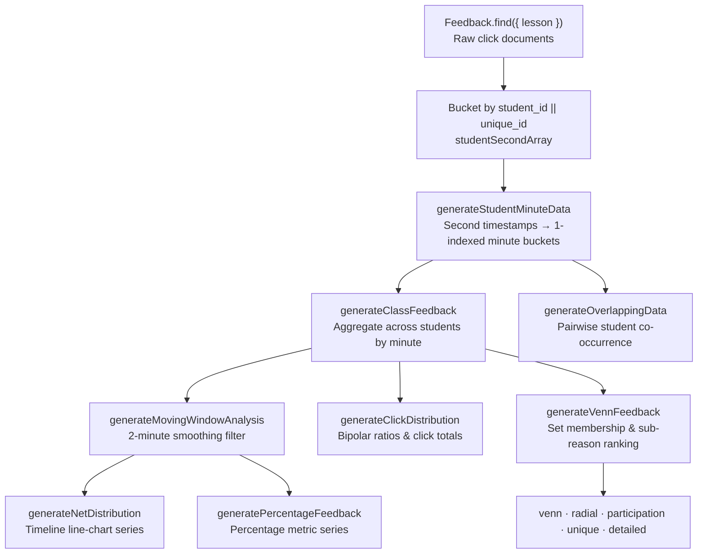

# Tcherly — Codebase Overview & System Reference

Generated documentation for the **Tcherly** (legacy: DEBE) online student-feedback tool.
Analysed at commit `520a74c` on `main`.

---

## Contents

- [Companion Architecture & Data Diagrams](#companion-architecture--data-diagrams)
- [1. What Tcherly Is](#1-what-tcherly-is)
- [2. Actors & Their Goals](#2-actors--their-goals)
- [3. Feature Map & Business Purpose](#3-feature-map--business-purpose)
- [4. Tech Stack](#4-tech-stack)
- [5. Repository Layout](#5-repository-layout)
- [6. System Architecture](#6-system-architecture)
- [7. Authentication & Authorization](#7-authentication--authorization)
- [8. The Feedback Analysis Pipeline](#8-the-feedback-analysis-pipeline)
- [Highest-Priority Findings](#highest-priority-findings)
- [Caveats](#caveats)

---

## Companion Architecture & Data Diagrams

| Document | What it covers |
|---|---|
| [ARCHITECTURE.md](./ARCHITECTURE.md) | System context, authenticated request path, feedback analysis pipeline |
| [ER_DIAGRAM.md](./ER_DIAGRAM.md) | Entity-relationship diagram for all 13 Mongoose models |
| [DATA_FLOW.md](./DATA_FLOW.md) | Sequence + flow diagrams: feedback capture, dashboard load, pipeline internals, three-identity auth, bookmark chain, Excel export, middleware chain |

---

## 1. What Tcherly Is

**Tcherly** is an **online student-feedback tool for improving lecture teaching practice**. It originates from educational technology research at **IDP-ET, IIT Bombay**, and is deployed at `https://www.tcherly.com`.

### The Problem It Solves
Conventional end-of-semester course surveys are **too coarse and arrive too late**. An instructor discovers that students struggled months after a lecture concludes, with no granular indication of *which specific moments* caused confusion. Tcherly provides **high-resolution, in-lecture formative feedback**: students react to specific moments while watching a video lecture, enabling teachers to review timestamped feedback aligned minute-by-minute with the video timeline.

### The Core Loop
```
Teacher uploads lecture (YouTube URL)
        ↓  Shares /l/<slug> link with class
Students watch video and submit real-time reactions at any second:
        Difficult · Easy · Boring · Engaging   (+ optional sub-reasons)
        ↓  Clicks stored with video timestamps
Teacher opens Lesson Dashboard:
        Line chart · Venn diagrams · Radial chart · Participation · Detailed sub-reasons
        ↓  Scrubs and selects a problematic time window
Teacher saves Bookmark → Question ("Why did engagement drop at min 12?") → Action ("Add worked example")
        ↓
Pedagogical intervention applied to subsequent lecture iterations
```
The **Bookmark → Question → Action** chain is the core value proposition, translating passive analytical charts into recorded pedagogical adjustments.

### Legacy Naming (DEBE)
The platform was formerly named **DEBE** (**D**ifficult, **E**asy, **B**oring, **E**ngaging). This identifier remains active across critical operational layers:
- `package.json`: package name is `debe-node`
- Cookies: `debe_token` (teacher), `debe_student_token` (student), `debe_researcher_token` (researcher)
- Access log: `debe_online.log` (`server.js`)
- UI copy: `"DEBE Interactions"` in `NewCharts/Venn.jsx`
- Default DB name: `test-debe` (`config/index.js`)
- Deployment repo: `git@github.com:localhoax/debe.git` (`ecosystem.config.js`)

Do not remove or rename `debe` identifiers without verifying cookie, database, or UI dependencies.

---

## 2. Actors & Their Goals

The application defines **three completely segregated authenticated identities**. They do not share a single user model or role hierarchy; each identity has its own Mongoose model, Passport strategies, refresh-token cookie, and client-side React auth provider.

| Actor | Model | Refresh Cookie | Client Auth Provider | Primary Goal |
|---|---|---|---|---|
| **Teacher** (`user`) | `database/models/user.js` | `debe_token` | `client/src/provider/auth.js` (`AuthContext`) | Manage courses/lessons, analyse student feedback, create bookmarks, log pedagogical actions |
| **Student** | `database/models/student.js` | `debe_student_token` | `client/src/provider/student-auth.js` (`StudentAuthContext`) | Watch video lectures, submit timestamped reactions and sub-reasons |
| **Researcher** | `database/models/researcher.js` | `debe_researcher_token` | Inline state in `client/src/pages/researcher.jsx` | Export cross-tenant raw feedback and interaction logs to Excel for academic study |

### Key Architectural Implications
1. **Dual Auth Context on Lesson Views (`/l/:id`)**: Both `AuthContext` (root) and `StudentAuthContext` (`ProvideStudentAuth`) mount simultaneously. A logged-in teacher viewing their own lesson URL is still prompted to authenticate as a student, as feedback entries must bind to student documents.
2. **Researcher Provisioning**: Researchers cannot self-register; they are provisioned exclusively via the CLI script `yarn generate` (`data/generate.js`).

---

## 3. Feature Map & Business Purpose

| # | Feature | Business Purpose | Primary Entry Points |
|---|---|---|---|
| **F1** | **Teacher Authentication** | Gates teacher functionality; collects research consent, institution, and mode at registration | `routes/auth.js`, `controllers/auth.js` |
| **F2** | **Course Management** | Groups lessons into course/semester containers; acts as ownership root | `routes/course.js`, `controllers/course.js` |
| **F3** | **Lesson Management** | Binds YouTube videos to shareable slugs; fetches video duration | `controllers/course.js:addNewLesson`, `controllers/lesson.js` |
| **F4** | **Student Authentication** | Identifies student participants to calculate individual overlap (Venn sets) | `routes/auth.js`, `controllers/student-auth.js` |
| **F5** | **Student Feedback Capture** | Ingests second-level reaction clicks with optional sub-reasons | `pages/lesson-id.jsx` → `POST /api/lessons/:id` |
| **F6** | **Interaction Logging** | Logs play, pause, seek, and rate-change telemetry for attention correlation | `controllers/log.js` → `POST /api/misc/log` |
| **F7** | **Feedback Analysis Pipeline** | Computes 8 analytical datasets from raw click documents in real time | `controllers/feedback.js` |
| **F8** | **Teacher Dashboard** | Interactive dashboard presenting timeline charts, distributions, and Venn views | `pages/lesson-id-dashboard.jsx`, `Dashboard/Advanced.jsx` |
| **F9** | **Bookmarks** | Persists teacher-selected time windows needing pedagogical attention | `components/Analysis/Bookmarks.jsx`, `controllers/lesson.js` |
| **F10** | **Question Generator** | Prompts structured pedagogical reflection regarding specific timeline drops | `components/Analysis/QuestionGenerator.jsx` |
| **F11** | **Action Tracker** | Documents concrete teaching interventions planned for upcoming lectures | `components/Analysis/ActionTracker.jsx` |
| **F12** | **Feature Levels** | Gating layer for Basic vs Advanced analytical tiers | `Dashboard/Advanced.jsx`, `UpgradeBlock.jsx` |
| **F13** | **Guided Tour** | Step-by-step onboarding walkthrough for new teachers | `components/Tour.jsx`, `pages/dashboard-tour.jsx` |
| **F14** | **Researcher Console** | Multi-institution Excel export tool for research analysis | `pages/researcher.jsx`, `controllers/researcher.js` |
| **F15** | **Marketing Site** | Public landing page, research background, and guidelines | `pages/landing.jsx`, `research.jsx`, `teacher-guidelines.jsx` |

### Feature Composition Flow
- **Containers**: F1 (Teacher Auth) → F2 (Courses) → F3 (Lessons)
- **Data Ingestion**: F4 (Student Auth) → F5 (Feedback Capture) + F6 (Telemetry Logs)
- **Analytics & Visualisation**: F7 (Analysis Pipeline) → F8 (Dashboard)
- **Pedagogical Action Loop**: F9 (Bookmarks) → F10 (Questions) → F11 (Actions)
- **Access & Research Control**: F12 (Tier Gating), F13 (Onboarding), F14 (Research Export)

---

## 4. Tech Stack

| Layer | Technologies | Notes |
|---|---|---|
| **Language** | JavaScript (ES6+, Node.js) | No TypeScript; sporadic JSDoc `@type` annotations |
| **Server Framework** | Express 4 (`server.js`) | Single process architecture (`instances: 1` in PM2) |
| **Server Templating** | Handlebars (`hbs`) | Used only for password reset views (`views/`); `pug` is an unreferenced dependency |
| **Authentication** | Passport (`passport-local` + `passport-jwt`) | 8 distinct strategies registered in `middleware/strategies.js` |
| **Session Store** | `express-session` + `connect-mongo` | **Mounted but vestigial**: all route authentications specify `{ session: false }` |
| **Database** | MongoDB via Mongoose 5 | 13 schemas located in `database/models/` |
| **Client Framework** | React 17 (Create React App), React Router 5 | Root at `client/`; path aliases configured via `jsconfig.json` (`baseUrl: src`) |
| **Client State** | React Context API | `AuthContext`, `StudentAuthContext`, `FeedbackContext` (no Redux) |
| **Form Handling** | Formik + Yup | Client-side validation; Yup also used in CLI generator |
| **Data Visualisation** | Recharts, `@upsetjs/venn.js`, D3, Custom SVG | Recharts for timeline charts; UpsetJS/D3 for Venn sets; custom SVG for radial heatmap |
| **Video Player** | `react-player` | Embedded YouTube iframe pointing to `youtube-nocookie.com` |
| **UI & Styling** | SCSS, Bootstrap 4, `react-bootstrap` | Located in `client/src/assets/styles/` |
| **File Generation** | ExcelJS | Generates multi-tab research workbooks in `controllers/feedback.js` and `researcher.js` |
| **Email Service** | Mailgun (`mailgun-js`) | Password-reset emails via `utils/mail.js` |
| **YouTube Metadata** | `simple-youtube-api` | Fetches lecture duration in seconds during lesson creation |
| **Process Manager** | PM2 | Configuration defined in `ecosystem.config.js` |

### Vestigial & Unused Dependencies
- `pug`: declared in `package.json` dependencies but never invoked
- `express-session` & `connect-mongo`: mounted in `server.js` but inactive across all endpoints
- `controllers/sync.js`: stub controller where all exported methods return HTTP 404
- `data/mock.js`: empty stub file
- `csurf`: present only on password-reset HTML routes; absent from JSON API endpoints

---

## 5. Repository Layout

```
tcherly/
├── server.js                  ← Express server bootstrap, middleware configuration, static routing
├── config/index.js            ← Centralised environment variable parser (single source of truth)
├── ecosystem.config.js        ← PM2 process definition and deployment scripts
│
├── routes/                    ← Thin HTTP routing definitions (middleware chaining to controllers)
│   ├── index.js               ← Server-rendered password reset routes + mounts /api/researcher
│   ├── auth.js                ← Teacher, student, and researcher auth routes
│   ├── course.js              ← Course CRUD and lesson creation endpoints
│   ├── lesson.js              ← Lesson edit/delete, bookmark CRUD, and feedback analysis endpoints
│   ├── misc.js                ← Telemetry logging, contact form, taxonomy options
│   ├── researcher.js          ← Researcher authentication and Excel export routes
│   └── sync.js                ← Vestigial sync stubs (returns 404)
│
├── controllers/               ← Core business logic
│   ├── feedback.js            ← Core feedback analysis pipeline (1000+ lines) & Excel exporter
│   ├── course.js              ← Course operations and lesson creation logic
│   ├── lesson.js              ← Lesson mutations and bookmark / question / action handling
│   ├── researcher.js          ← Researcher authentication and cross-tenant export logic
│   ├── student-auth.js        ← Student authentication and token management
│   ├── auth.js                ← Teacher authentication and password-reset handling
│   ├── log.js                 ← Telemetry log ingestion
│   └── misc.js                ← Miscellaneous utility controllers
│
├── database/
│   ├── index.js               ← MongoDB connection singleton (`CreateConnection`)
│   └── models/                ← 13 Mongoose schemas (User, Student, Lesson, Feedback, Bookmark, etc.)
│
├── middleware/
│   ├── strategies.js          ← 8 Passport strategies defining local and JWT authentication logic
│   ├── auth.js                ← Route authentication guards and resource ownership verification
│   ├── passport.js            ← Passport instance setup
│   └── session.js             ← Express session configuration (vestigial)
│
├── handlers/misc.js           ← Client IP extraction, UUID cookies, ObjectId validation
├── utils/                     ← Email helper (Mailgun), YouTube API wrapper, logger
├── data/
│   ├── data.js                ← Master feedback taxonomy (sub-reason enums; shared with Mongoose models)
│   ├── generate.js            ← CLI utility to seed researcher accounts (`yarn generate`)
│   └── generated/             ← Output directory for generated Excel reports (gitignored)
│
└── client/                    ← Frontend React SPA (Create React App)
    └── src/
        ├── App.jsx            ← Master client route table with auth-state branching
        ├── index.js           ← Application root mount wrapped in ProvideAuth
        ├── provider/          ← Context providers: auth.js, student-auth.js, feedback.js
        ├── handler/api.js     ← Axios client instance with base URL resolution
        ├── pages/             ← Page-level components
        │   ├── lesson-id.jsx           ← Student video player and reaction submission interface
        │   ├── lesson-id-dashboard.jsx ← Teacher dashboard container and data loader
        │   ├── courses/_id/index.jsx   ← Course management and lesson CRUD
        │   └── researcher.jsx          ← Standalone researcher analytics portal
        └── components/
            ├── Dashboard/Advanced.jsx  ← Primary teacher dashboard layout and tier gating
            └── Analysis/               ← Analysis charts and pedagogical intervention controls
                ├── Bookmarks.jsx, QuestionGenerator.jsx, ActionTracker.jsx
                ├── Charts/Overview.jsx ← Primary timeline line chart
                └── NewCharts/          ← Active chart implementations (Venn, Radial, Participation, Detailed)
```

### Chart Component Generations
`client/src/components/Analysis/` contains two sets of chart implementations:
- **Legacy Components**: `Venn.jsx`, `Radial.jsx`, `Participation.jsx`, `DetailedFeedback.jsx`
- **Active Components**: `NewCharts/Venn.jsx`, `NewCharts/Radial.jsx`, `NewCharts/Participation.jsx`, `NewCharts/DetailedFeedback.jsx`

`Dashboard/Advanced.jsx` exclusively imports the `NewCharts/` versions. Legacy versions remain in the tree for older views; verify imports before refactoring or removing.

---

## 6. System Architecture

### 6.1 Architectural Structure
Tcherly follows a **monolithic 3-tier architecture**:
```
React SPA (Create React App) ──HTTP / REST──> Express API (Node.js) ────> MongoDB (Mongoose)
```
There are no microservices, external message queues, or distributed caches. All analytics calculations execute synchronously within the Express request lifecycle.

- **Production Deployment**: A single Express process serves both the API endpoints and the static compiled React application (`client/build`). Unmatched non-API routes fall back to `client/build/index.html` via a wildcard handler.
- **Development Environment**: Two concurrent processes run via `yarn dev`: the React development server on port `8080` and Express on port `3000`, connected via CORS and `REACT_APP_API_URL`.

### 6.2 Middleware Execution Order (`server.js`)
The execution sequence is order-sensitive:
1. `serveFavicon`: static favicon serving
2. `express.json` / `express.urlencoded`: request body parsing
3. `cookieParser`: parses incoming cookies (must precede JWT/session checks)
4. `cors`: enabled strictly in development (`server.js:47`)
5. `await db.connect()`: database connection initialization
6. `session`: session middleware (mounted only if database connects successfully)
7. `morgan`: request logging (console in dev, `debe_online.log` in production)
8. `passport.initialize()`: initialises Passport context
9. `trust proxy`: configured to trust upstream reverse proxies (`req.ip` honors `X-Forwarded-For`)
10. `express.static`: serves public assets
11. Route mounting (`/`, `/api/auth`, `/api/courses`, `/api/lessons`, `/api/misc`, `/api/sync`)
12. API catch-all 404 handler (`/api/*`)
13. Production React SPA fallback handler (`get("*")`)
14. Global error handling middleware

### 6.3 Database Connection & Fail-Open Risk
`database/index.js` encapsulates MongoDB connection logic in `CreateConnection`.
- `db.connect()` never rejects: connection errors are caught and logged to the console without re-throwing.
- If the MongoDB instance is unreachable, `server.js` continues booting. Express begins accepting requests, but any subsequent database query hangs or fails, and no health-check endpoint exists.

### 6.4 Client-Side Routing Dual-Table (`App.jsx`)
`client/src/App.jsx` dynamically renders one of two distinct routing trees depending on whether `user` is populated:
- **Logged-Out State (`user === null`)**: Renders marketing routes, `/login`, `/register`, password reset pages, the student lesson interface (`/l/:id`), and researcher login.
- **Logged-In State (`user` present)**: Renders the authenticated teacher dashboard, course views (`/c/:course_id`), lesson dashboards (`/l/:id/dashboard`), and redirects auth pages back to the dashboard.

Because `/l/:id` is accessible to both students (unauthenticated teachers) and teachers, it is defined in both branches.

### 6.5 Cross-Cutting Concerns
- **Logging**: Morgan appends CSV records to `debe_online.log` without log rotation, creating unbounded disk growth in production.
- **Caching**: No caching layer (Redis or in-memory) exists; identical dashboard loads repeatedly recalculate the full aggregation pipeline.
- **CSRF Protection**: Applied exclusively to server-rendered password-reset routes via `csurf`; JSON endpoints rely solely on Bearer token validation.
- **Secret Fallback**: `config/index.js` defaults both JWT and session secrets to `"setup_dotenv_file_for_security"` if `.env` is absent.

---

## 7. Authentication & Authorization

### 7.1 Passport Strategy Architecture
`middleware/strategies.js` registers 8 distinct Passport strategies:
- **Teacher**: `signup` (Local), `signin` (Local), `verify` (JWT)
- **Student**: `student-signup` (Local), `student-signin` (Local), `student-verify` (JWT)
- **Researcher**: `r-signin` (Local), `r-verify` (JWT)

All JWT verification strategies share the same cryptographic secret (`config.token.secret`) and identical token payloads (`{ _id, email }`). Differentiation occurs solely through the Mongoose model queried during token verification.

### 7.2 Two-Token Authentication Scheme
```
┌── Short-Lived Access Token (JWT) ────────────────────────────┐
│ Lifetime: 1 hour (JWT_EXPIRY: 3600000 ms)                    │
│ Storage : In-memory JS variable (`memoryToken`)              │
│ Security: Immune to XSS persistent storage theft; lost on    │
│           page reload                                        │
│ Header  : Authorization: "Bearer <jwt>"                      │
└──────────────────────────────────────────────────────────────┘
┌── Long-Lived Refresh Token ──────────────────────────────────┐
│ Lifetime: 30 days ("remember me") or 24 hours                │
│ Storage : httpOnly cookie (debe_token / debe_student_token)  │
│ Database: Stored in MongoDB `RefreshToken` collection        │
│ Value   : 128-character base64 crypto string                 │
└──────────────────────────────────────────────────────────────┘
```
Because access tokens reside in memory, **every browser reload triggers `POST /api/auth/refresh`** (`App.jsx:47-56`) while a full-screen `<Loader/>` displays.

### 7.3 Authorization Architecture & The IDOR Vulnerability
Authorization involves two validation layers:
1. **Authentication Guard**: `verifyMiddleware` verifies that the caller possesses a valid teacher JWT.
2. **Resource Ownership Guard**: `verifyResourceIsForUser(checkLessonBelongsToUser)` checks that `Lesson.findOne({ user: req.user._id, _id: req.params.id })` exists.

> **Critical Authorization Gap:**
> The resource ownership check is applied to **only one route** across the entire application:
> ```js
> GET /api/lessons/:id/feedback
> ```
> All lesson mutation and deletion endpoints (`PUT /api/lessons/:id`, `DELETE /api/lessons/:id`) and all seven bookmark endpoints check only that the caller is *a* logged-in teacher (`verifyMiddleware`), omitting ownership checks. Any authenticated teacher can mutate, delete, or bookmark any other teacher's lessons if they know or guess the lesson ID.

### 7.4 Password Reset Mechanism
Password resets use server-rendered Handlebars views:
1. `POST /api/auth/password/forgot` generates a 168-character token, stores it in a `Token` document (`expires_at`: +24h, `used`: false), and sends an email via Mailgun.
2. The user navigates to `/password/reset/:token` (validated with CSRF) and submits a new password.
3. **Flaw:** `controllers/auth.js:resetPassword` validates `used: false`, but **never checks `expires_at`**. Reset tokens remain valid indefinitely until used.

---

## 8. The Feedback Analysis Pipeline

Located in `controllers/feedback.js`, the feedback analysis pipeline is the computational heart of Tcherly. It executes synchronously and in-memory upon every `GET /api/lessons/:id/feedback` request.

### 8.1 Pipeline Flow Diagram


### 8.2 Detailed Pipeline Stages

#### Stage 0: Student Partitioning (`getAllFeedbackForLesson`)
Retrieves all feedback rows for the lesson sorted by creation time:
```js
const feedbacks = await Feedback.find({ lesson: lesson._id }).sort({ createdAt: 1 });
```
Clicks are grouped into `studentWiseObject` using `feedback.student_id || feedback.unique_id`. The fallback ensures backwards compatibility with legacy anonymous feedback rows stored under a UUID cookie before student accounts existed.

#### Stage 1: Dense Minute Mapping (`generateStudentMinuteData`)
Transforms discrete click timestamps into a continuous array of length `lectureLength`:
- **Edge Trimming**: Discards feedback in the first and last `1/120` (0.83%) of the video (`minThreshold = durationSeconds / 120`). For a 60-minute video, clicks within the first and last 30 seconds are silently dropped.
- **Minute Bucketing**: Minutes are 1-indexed: `minute = Math.ceil(seconds / 60)`.
- **Boolean Collapsing**: Within a single minute for a given student, multiple clicks of the same category collapse to a single boolean (`value.easy = feedback.easy || value.easy`). Counts are preserved separately during class aggregation.
- **Window Filtering**: Evaluated with an exclusive lower bound and inclusive upper bound: `s.minute >= min + 1 && s.minute <= max`.

#### Stage 2: Class Aggregation (`generateClassFeedback`)
Aggregates individual student minute arrays into class-wide minute objects containing total counts (`easy`, `difficult`, `engaging`, `boring`) and per-student click breakdowns.
- **Index Coupling**: Combines student arrays using `consolidatedData[i]`. This requires all student arrays to share identical lengths and window offsets.

#### Stage 3: Moving Window Smoothing (`generateMovingWindowAnalysis`)
Applies a forward-looking 2-minute smoothing filter:
```js
feedback.easy = Math.round((feedbackNext.easy + feedback.easy) / 2);
feedback.net_engagement = feedback.engaging - feedback.boring;
feedback.net_difficult  = feedback.difficult - feedback.easy;
```
The final minute is left unsmoothed, and `Math.round` introduces minor cumulative rounding discrepancies.

#### Stage 4: Distributions & Bipolar Ratios
- **Net Series (`generateNetDistribution`)**: Outputs `net_engagement` and `net_difficult` series driving the primary timeline chart.
- **Click Distributions (`generateClickDistribution`)**: Treats engagement and difficulty as two independent bipolar axes:
  - Difficulty Ratio: `easy / (easy + difficult)`
  - Engagement Ratio: `engaging / (engaging + boring)`
  Missing feedback in either pair results in division by zero (`NaN`), requiring client-side guards.

#### Stage 5: Set Membership & Venn Computations (`generateVennFeedback`)
Derives five analytical structures:
1. `venn`: Per-student set membership counts for Venn diagrams (each student counted once per set).
2. `radial`: Per-click counts for the radial heatmap. Intersections use `Math.max(countA, countB)`.
3. `participation`: Arrays of distinct student IDs present in each reaction category.
4. `unique`: Cardinality counts (`.size`) of unique participants.
5. `detailed`: Sub-reason breakdown produced by `sortAndCount`: extracts the top 3 sub-reasons by frequency and groups remaining responses into a synthetic 4th `"Others"` category.

### 8.3 Double Pipeline Execution
`getAllFeedbackForLesson` executes the entire pipeline **twice per request**:
1. Once for the active zoom window (`req.query.min`, `req.query.max`).
2. Once for the complete lecture duration (`{ min: 0, max: lessonLength }`).

This design allows the primary overview line chart to display the entire video timeline while detailed breakdown charts reflect only the selected window. Consequently, computation cost is doubled on every request.

---

## Highest-Priority Findings

| Priority | Issue | Location | Impact |
|---|---|---|---|
| **P0** | **IDOR Vulnerability** | `routes/lesson.js:21-48`, `controllers/lesson.js` | Lesson mutation (`PUT`), deletion (`DELETE`), and all bookmark endpoints lack ownership checks; any authenticated teacher can modify any lesson |
| **P0** | **Hanging Error Handler** | `server.js:90-93` | The global error middleware calls `res.status(500)` but never invokes `.json()` or `.send()`, causing 500 errors to hang client requests indefinitely |
| **P1** | **Bypassed Rate Limiter** | `controllers/auth.js:154` | Password-reset email rate limiter has an operator-precedence bug in its timestamp condition, disabling throttle checks |
| **P1** | **Unchecked Tier Upgrade** | `routes/auth.js:45`, `controllers/auth.js` | `PUT /api/auth/upgrade` updates `feature_level` to `"advanced"` without server-side validation or payment verification |
| **P1** | **Unresponsive Endpoints** | `controllers/auth.js:incrementTour`, `upgradeFeatureLevel` | Two controller handlers complete execution without sending an HTTP response, causing clients to await timeouts |
| **P2** | **Silent Analysis Write Failure** | `controllers/lesson.js:saveLessonAnalysis` | Attempts to write analysis data to a field absent from the Mongoose `Lesson` schema, silently discarding updates |
| **P2** | **Unindexed Queries & Missing Cascades** | `database/models/feedback.js`, `controllers/lesson.js` | `feedback.lesson` lacks a database index; deleting lessons leaves orphaned feedback documents; analysis recomputes twice per request without caching |

---

## Caveats

- **Test Suite**: No automated unit or integration tests exist within the repository.
- **Styling Scope**: Presentational SCSS and Bootstrap styles have not been audited for functional correctness.
- **Researcher Frontend**: `client/src/pages/researcher.jsx` has been verified at the authentication boundary; export tables and UI components operate independently.
- **Code Changes**: Always cross-reference controller and model logic against current branch commits before refactoring.
